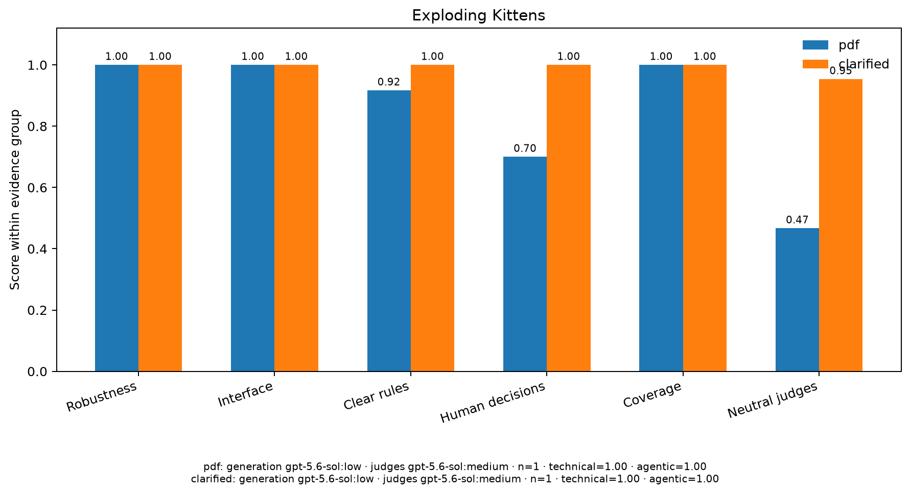

# Exploding Kittens: Original-PDF vs. präzisierte Fassung

## Ergebnis auf einen Blick

Beide Spielumgebungen sind technisch stabil. Die Implementierung aus dem Original-PDF verfehlt vier getestete Regelinteraktionen. Nach Präzisierung der gefundenen Regelungslücken besteht eine frische Implementierung alle 22 Szenarien; der neutrale Judge-Mittelwert steigt von `0,467` auf `0,953`.

**Modellsetup für beide Bedingungen:** Implementierung mit `gpt-5.6-sol`, Thinking `low`; drei neutrale Judges und drei Personas mit `gpt-5.6-sol`, Thinking `medium`.

| Evidenz | Original-PDF | Präzisierte Fassung |
|---|---:|---:|
| Technical Gate (**EV1**) | 4/4 | 4/4 |
| Runtime Robustness (**EV2**) | 100/100 | 100/100 |
| Interface (**EV3**) | 1,000 | 1,000 |
| Klare Regeln (**EV4**) | 11/12 | 12/12 |
| Klarstellungsabhängige Regeln (**EV5**) | 7/10 | 10/10 |
| Szenarioabdeckung (**EV6**) | 22/22 | 22/22 |
| Neutraler Judge-Mittelwert (**EV7**) | 0,467 (SD 0,042) | 0,953 (SD 0,055) |
| Persona-Reviews (**EV8**) | zusätzliche Regel- und Randfallbefunde | keine belegten kritischen/großen Defekte; 3 offene Fragen |
| Materielle Annahmen (**EV9**) | 3 | 2 |

*EV1–EV3 und EV6 sind erfolgreiche technische Kontrollen. EV4, EV5 und EV7 zeigen den für die Quellenänderung relevanten Unterschied.*

## Erkannte Abweichungen des Originals

- **EV4:** Fünf-Karten-Kombination bei anfangs leerem Ablagestapel.
- **EV5:** verbleibende Angriffszüge nach einer Entschärfung.
- **EV5:** Ankündigung der Drilling-Parameter vor NÖ!/DOCH!-Reaktionen.
- **EV5:** wiederhergestellte Aktion gegen ein inzwischen leeres Ziel.

Die präzisierte Implementierung besteht EV1–EV6 vollständig. Das stützt die Diagnose, dass die Quellspezifikation zu Problemen der ursprünglichen Übersetzung beigetragen hat. Mit einem Implementierungslauf pro Bedingung (`n=1`) ist dies noch kein Varianz- oder alleiniger Kausalitätsnachweis.

## Offene Fragen nach der Präzisierung

- Darf eine Katzenkarte einzeln und ohne Effekt gespielt werden?
- Darf ein Drilling einen Spieler ohne Handkarten als Ziel wählen?
- Wie lange soll unverändertes Vorschauwissen digital sichtbar bleiben?

## Aufwand

| Ressource | Original-PDF | Präzisierte Fassung |
|---|---:|---:|
| Implementierungsmodell | `gpt-5.6-sol` (`low`) | `gpt-5.6-sol` (`low`) |
| Reviewmodell für Judges/Personas | `gpt-5.6-sol` (`medium`) | `gpt-5.6-sol` (`medium`) |
| LLM-Aufrufe | 7 | 7 |
| Input-Tokens (davon gecacht) | 1.035.093 (802.304) | 1.523.405 (1.251.584) |
| Output-Tokens | 48.345 | 44.734 |
| API-äquivalente Kostenschätzung | 3,02 USD | 3,33 USD |
| Python-Codezeilen | 187 | 320 |

## Detailansicht

**[Alle Evaluationen, Checks 01–06, 22 Szenarien, Einzel-Judges, Personas und Rohpfade öffnen](DETAILS.md)**
